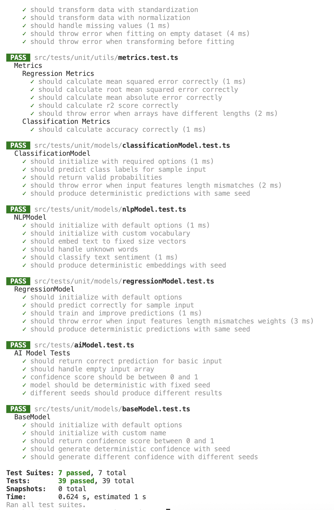

# 🧠 AI Model Testing Framework

This repository provides a modular and extensible testing framework for AI/ML models using **TypeScript** and **Jest**. It includes unit tests for models, services, and utilities in a clean project structure.

---

## 📁 Project Structure
    ├── src/
    │ ├── models/ # Core model classes (Base, Classification, Regression, NLP)
    │ ├── services/ # Service layer (monitoring, registry, prediction)
    │ └── utils/ # Helper utilities (metrics, feature importance, etc.)
    ├── tests/
    │ └── unit/ # Unit tests
    │ ├── models/
    │ ├── utils/
    │ └── aiModel.test.ts
    ├── jest.config.js # Jest configuration
    ├── package.json # Project metadata and dependencies
    ├── tsconfig.json # TypeScript configuration
    └── structure.md # Project architecture notes

## 🧪 Running Tests

This project uses **Jest** as the testing framework.

### ▶ Run All Tests

```bash
npm install
npm test
````

## 👀 Run in Watch Mode
```bash
npm run test:watch
````
## 📦 Installation
```bash 
git clone https://github.com/your-username/ai-model-test-framework.git
cd ai-model-test-framework
npm install
```

## ⚙️ Configuration
Example jest.config.js
```javascript
module.exports = {
  preset: 'ts-jest',
  testEnvironment: 'node',
  roots: ['<rootDir>/tests/unit'],
  moduleFileExtensions: ['ts', 'js', 'json', 'node'],
};
```
## Test Results



## 📚 Included Components

### Models
 - baseModel.ts – Abstract model base class
 - classificationModel.ts – Classification logic
 - regressionModel.ts – Regression logic
 - nlpModel.ts – Natural language processing model

### Services
 - modelMonitor.ts –> Monitoring utility
 - modelRegistry.ts –> Registry logic
 - predictionService.ts –> Prediction logic

### Utilities
   - metrics.ts, featureImportance.ts, dataProcessor.ts – Supporting modules for evaluation and preprocessing

### 🤝 Contribution

 - Feel free to fork the repo and submit pull requests. Suggestions and improvements are always welcome!

### 📝 License

MIT License © 2025